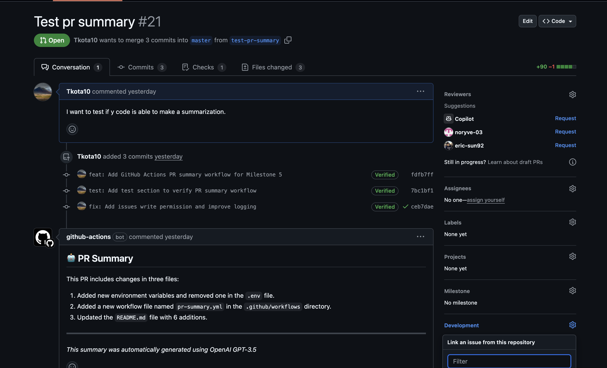

## Part 1

We have added a new feature to the backend that allows users to generate a summary of a pull request using OpenAI's GPT-3.5 model. The feature is triggered when a pull request is opened or synchronized and will post a summary of the changes in the pull request as a comment.

To use it, checkout out to the Milestone-5 branch.

The code to run is in .github/workflows/pr-summary.yml.

Here's a picture of the summary of an example PR request that I did:


You should be able to test it by submitting a PR from the milestone-5 branch and checking the Actions. YOu will also get an email like above.

My personal OpenAI key is stored in the GitHub secrets, so please don't use it too much haha!

## Part 2

I used the Claude Code Assistant to review a Pull request from my teammate.

Honestly, after doing so I don't think it's a very effective way of using Claude Code. It seemed a bit overkill. I think part of good coding development is reviewing each other's work and I think AI models are not there yet to replace this part of development. 

I think the reviewing may have been easier if it was for bigger PR requests, but I noticed that it had issues when dealing when some of the changes were very intricate. 

I think something like Part 1 for me because then I can get a high level overview of the PR and then that can help frame my thinking when I'm doing the review manually.

Let me know if you need more information (want to make this as streamlined for your to read).

## Part 3

This is found in the Neotix 

**Overview**
This implementation creates an automated assistant that interacts with the Neotix frontend dashboard using Playwright for browser automation. The assistant can navigate through different sections of the dashboard interface.

1. **Playwright**: For browser automation and testing
   - Version: Latest (installed via npm)
   - Purpose: Handles all browser interactions and navigation
   - Installation: `npm install -D @playwright/test`


Running the Assistant

Note: This has to be run on the Neotix-Frontend repo!

1. **Prerequisites**
   - Node.js installed
   - npm packages installed
   - Playwright installed
   - Frontend running on http://localhost:5173

2. **Commands**
   ```bash
   # Run the tests
   npx playwright test --headed
   ```
**Example Output**

<truncated 1 lines>

Running 1 test using 1 worker

     1 …rd navigation test
Attempting to click Home
Successfully clicked Home
Attempting to click Dashboard
Successfully clicked Dashboard
Attempting to click Search Methods
Successfully clicked Search Methods

Attempting to click My GPUs
Successfully clicked My GPUs
Attempting to click Universe
Successfully clicked Universe
Attempting to click Docs
Successfully clicked Docs

  1 passed (30.5s)
**General Thoughts**

THis was insane to use. It feels like the future. I went to the YC talk by Spur and they talked a lot about how Browser use agents were powering Spur! That makes sense and I'me xcited to continue to use it.